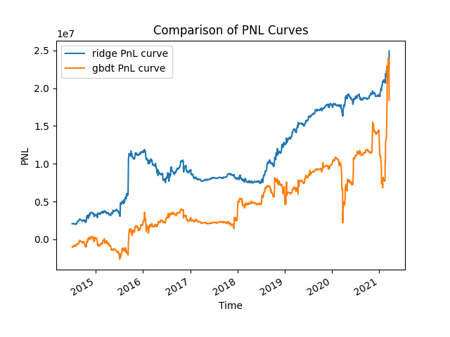

# StockLongShort

Report.md + Report.pdf are my reports

Codes are implemented in Python, with alpha research + data analysis + predictive model and backtest engine (Implemented a backtest engine on my own since Backtrader does not meet with requirement of the data and idea).

EDA.py & DataPreprocess.py -> Data exploratory analysis and preprocessing

SignalResearch.py -> Signal factories

Model.py -> Predictive model

EDA.py -> Exploratory Data Analysis

Backtest.py -> Backtest the strategy and provide the outputs (which can be found in Report.pdf)

## Overall Description

PnL curve:

