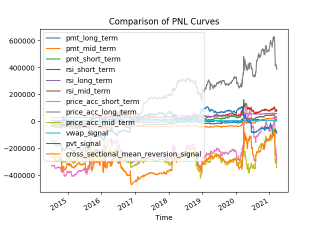
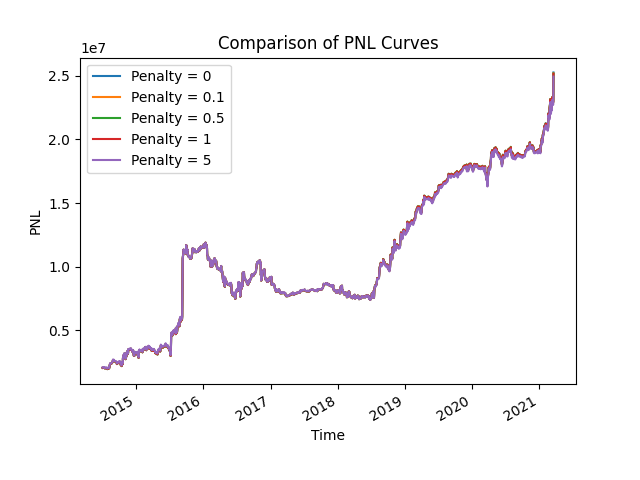
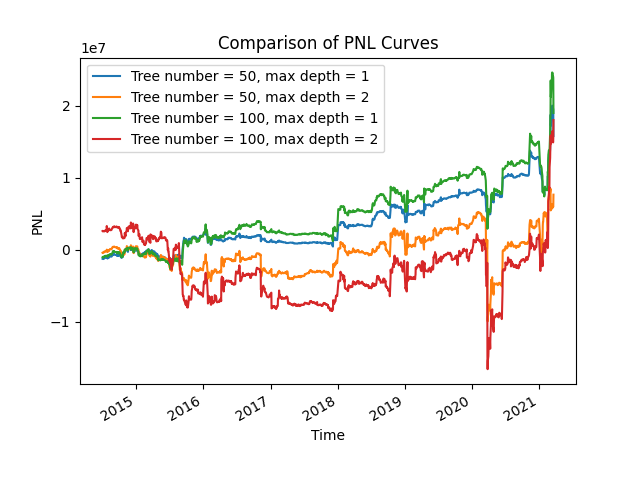
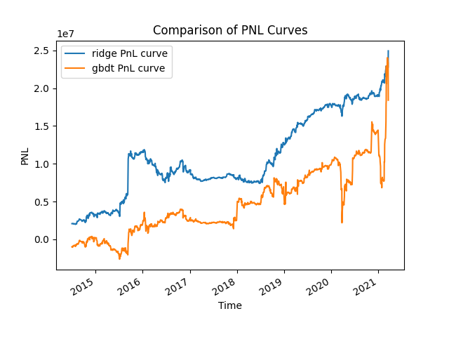

# Strategy Research on the Stock Market

## Overview

In the `data.csv` file, we are provided with the stock price data with its columns from 2013 to 2021. 248 stocks in
total have been selected and a strategy is required to be constructed to invest in these stocks.

In this article, we construct an investment model and adopt a long/short strategy to make money from the stock market
based on the price & volume data provided. Since we only have limited information of the market (i.e. only price &
volume available), we won't expect our strategy to make a significant amount of money from the market. Empirical
evaluations demonstrate that our model has a relative satisfactory performance in general.

In summary, we develop a long short stratgy based on a factor model. In this project, we also develop a backtest engine
that is capable of backtesting our strategy on the historical data. Rolling fitting strategy is adopted to empirically
evaluate the performance of our model by model selection and comparison to benchmark models.

## Research Outline

To further facilitate with our argument, we shall briefly describe the outline of our research process in section.

In general, our research pipeline follows the classical quantitative research pipeline, which consists of 5 parts:

1. Exploratory Data Analysis (EDA)
2. Alpha Research
3. Predictive Model Development
4. Portfolio Optimization
5. Backtest & Evaluation

In the first step, we perform some exploratory data analysis to understand what the data looks like.

In the alpha research step, we generate a series of $\alpha$ signals that can be used to predict the future return of
the stocks. Each signal is relatively weak, which motivates us to develop a model to combine them altogether and form a
main $\alpha$. We long the asset if the main $\alpha$ is positive and short the asset conversely. We deploy this
strategy on each of the stock and optimize the weight using various optimization procedures.

Finally, we backtest the performance of our model using a rolling estimation procedure by periodically re-estimate our
model from $2013$ to $2021$ and summarize the out-of-sample performance.

From a software architecture point of view, we divide our model into 6 scripts. The `EDA.py` script mainly performs some
exploratory data analysis. `SignalResearch.py` serves as the signal factory, which can automatically produce long-short
term signals from the data by pre-designed approaches. The `Strategy.py` script implements the main trading strategy,
with the alpha model and the rolling fitting model. Finally, we backtest our model by the `Backtest.py` and assess the
performance with functions defined in `Metrics.py`.

Tge above architecture ensures that each part of the whole strategy is well separated and decoupled. This means that our
framework is flexible and friendly to extension. Additional Gears (such as additional alpha signals, predictive models)
can be added into the framework easily in the future.

## Exploratory Data Analysis

In this section, we present some exploratory data analysis of our data, which can help us obtain a better understanding
of our dataset.

In general, by simple calculation with `pandas`, we can easily conclude that there are 248 stocks in all and these
stocks are not aligned with each other. Some stocks start directly from year $2013$ while others start later in $2014$
or $2015$.

We further check the pairwise correlation between the stocks to better assess our risk exposure. The following image
describes the pairwise correlation between each of the two stocks over the past 8 years and it is clear that most of
them are not strongly correlated to each other.

However, several stocks are negatively correlated to each other, which indicates that some portfolio optimization
techniques will be needed to ensure that the correlation between stock pairs don't cause extra risk to our model. On the
other hand, correlation between stocks also suggest that cross-sectional $\alpha$ signals can be generated to help us
better predict the future return.

Although correlation pairs may lead to an opportunity of pairs trading or statistical arbitrage, we won't implement the
pairs trading strategy here due to the time limitation. Long/short strategies will be adopted to facilitate our
investment strategy.

## Alpha Research

In this section, we discuss our alpha research framework.

Since only price & volume data is available, we shall mainly construct alpha signals from the price & volume. In
general, we construct two families of alpha signals: The first family of alpha signals consist of signals obtained from
momentum (purely based on price) while the second family mainly consists of cross-sectional or weighted signals from the
volume.

The constructed signals are relatively simple and interpretable due to the time limit. They can be directly calculated
by the functions defined in `SignalResearch.py`.

The momentum signals include price momentum, RSI signal and price acceleration signal, each of them defined in long (
90-day window), mid (30-day window) and short (10-day window). Therefore, we construct 9 momentum-based signals.

Apart from the momentums, we also construct the VWAP signal (Volume Weighted Average Price), PVT signal (Price Volume
Trend), OBV Signal (On Balance Volume) and cross sectional mean reversion signal. These signals capture information
apart from the momentum, such as the correlation between price and volume, or prices and volumes accross different
stocks.

### Signal Assessment

The aforementioned signals are relatively common and we don't expect them to be magic signals that have crazy return. In
general, they are just very general signals that have weak prediction power.

The following image provides a description to the PnL curves of each signal selected (starting from the second trading
day, after buying the assets).As we can see, most of the signals are very weak and some of them are even negative in
capturing the market price movement. Additionally, the long-term price acceleration signal is very crazy since it
significantly outperforms all other signals.

The following table summarizes the overall performance of the signals we use. It is worthwile to mention that the
overall performance of long-term price acceleration is not that attractive now since it suffers from a significant draw
back at the very beginning. It can be seen that most of the signals are relatively weak.

|                                       |      pnl | sharpe_ratio | max DD over PnL |
|:--------------------------------------|---------:|-------------:|----------------:|
| pmt_long_term                         |    37341 |     0.465613 |         1.00157 |
| pmt_mid_term                          |  31382.4 |    -0.656326 |         1.16181 |
| pmt_short_term                        |   111968 |     0.515981 |        0.905766 |
| rsi_short_term                        |  92723.1 |     0.647745 |        0.775651 |
| rsi_long_term                         |  30255.8 |      0.57662 |         0.54986 |
| rsi_mid_term                          |  24980.2 |    -0.252297 |         1.20537 |
| price_acc_short_term                  |  19570.5 |      0.11102 |         21.7885 |
| price_acc_long_term                   |   535857 |      -0.3251 |        0.459452 |
| price_acc_mid_term                    |  -113261 |     0.414742 |        -2.64748 |
| vwap_signal                           | -1032.99 |    -0.312291 |        -1.51115 |
| pvt_signal                            |   -79178 |   -0.0609057 |        -2.91452 |
| cross_sectional_mean_reversion_signal |    10778 |     0.387342 |          23.719 |

It is also extremely possible that the signals might suffer from multicollinearity since they are constructed with
information highly similar to each other. Therefore, we should implement predictive model that could alleviate this
problem in the next section.

## Predictive Model Development

In this section, we shall develop a model that is capable of combining the model together and forming a main alpha to
predict the future return of the market.

In general, what we want is that assume we have observations of the signals $\alpha$, we seek a model $f$ such that $f(
\alpha)$ becomes an estimation or prediction of the return in the next day.

To efficiently obtain the model, we adopt the empirical risk minimization procedure to find the model from a function
class $\mathcal{F}$. That is, we collect observed signals $\alpha_i$ and observed returns $r_i$ from a training set in a
window in the past, and find the function that minimizes the objective function:
$$
\hat{f}=\arg\min_{f\in\mathcal{F}}\sum_i l(r_i,f(\alpha_i))
$$
Where $l$ is some loss/risk function. Notice that return in a specific day must be aligned to the previous day to
prevent forward looking.

In our project, we generally use a penalized linear model (Ridge Regression) or committe machine (Gradient Boosting
Tree) to fit the model. The former can efficiently handle multicollinearity and the latter generally doesn't have the
problem of multicollinearity since it divides the space according to a combination of a series of regression trees.

In practice, we follow a rolling fitting strategy to fit our model. For each year, we train on the data over the last 4
years and use the fitted model as a predictor. We re-fit our model every year to make sure that the latest information
can be integrated into our model.

In summary, our pipeline is rather clear: Every year we train a model $\hat{f}$ on the training set $\alpha_
{train},\mathbf{r}_{train}$, we use this model to long/short the asset according to its prediction on the testing
dataset $\alpha_{test},\mathbf{r}_{test}$, which is the data in that year.

Since $\hat{f}$ can be viewed as a black box that produces the output from the input, we have the potential to use far
more complicated model such as neural network to produce more efficient predicitons. However, these complicated model
might suffer from overfitting or instability due to the weakness of our alpha.

Apart from the trading direction, we also stress that the trading volume may also be of vital importance. In our
backtesting framework, we set trading volume as $1$ for simplicity. In practice, the volume can be determined by the
volatility of the stocks.

## Portfolio Optimization

Since we have over 200 stocks and we trade each stock separately, it is essential for us to notice the risk caused by
correlation. Moreover, we can also allocate our asset in a clever manner to reduce our variance and increase our profit.

The simplest optimization strategy is to place equal amount of cash on each of the asset. Apart from this, we can also
optimize our portfolio by solving the mean-variance portfolio optimization technique:
$$
\arg\min \mathbf{w}^T\mathbf{R} - \frac{1}{2}\mathbf{w}^T\Sigma \mathbf{w}
$$
$$
s.t. 1^T\mathbf{w}=1\\
w\geq 0
$$
Where $\mathbf{R}$ is the return and $\Sigma$ is the covariance of the return.

We can also consider solving the portfolio with variance minimized:
$\Sigma$:
$$
\arg\min \mathbf{w}^T\Sigma \mathbf{w}
$$
$$
s.t. 1^T\mathbf{w}=1\\
w\geq 0
$$
Both approaches are expected to efficiently reduce the risk. However, our dataset is not well-aligned, which means
portfolio optimization can be difficult since we cannot optimize the weight on stocks that have not been added into
consideration yet (For instance, some stocks don't have history in 2013). Padding the entries with 0 is also not
acceptable since this will negatively affect our alpha model. Therefore, we finally used uniform allocation as the
portfolio strategy since portfolios constructed by optimizing suffers from the aforementioned drawbacks. With time
permitted, complicated optimization strategies can be adopted to efficiently minimize the risk and boost the return.

## Evaluation

In this section, we evaluate the performance of our model by evaluating its metrics (includign Sharpe ratio, PnL and max
drawdown over PnL) and its PnL curve.

### Model Selection

First, it is vital for us to perform model selection, which can help us select the model with best hyperparameters.

We empirically evaluate the out-of-sample performance by rolling fitting, which is similar to cross validation in
principle. For ridge regression model, we set the penalty from 0 to 5 (with 0 being the benchmark model). For GBDT, we
set number of trees as 50 or 100 and max depth being 1 or 2.

The following image describes the PnL curve of ridge regression. As we can see, ridge model with different penalty terms
perform similarly to each other, with larger penalties slightly more stable.

The following image describes GBDT-based models with different hyper parameters. Unfortunately, GBDT models behave
relatively poor under all parameter settings. Several models even suffer from extreme drawback and consistently lost
money for the majority of time.

The above out-of-sample performance evaluations suggest we should probably choose ridge regression over GBDT-based
models since the latter behaved poorly. This may possibly due to potential overfitting since we only ahve limited data
and signal.

### Overall Performance

Finally, we compare the best Ridge model over the best GBDT-based model:

The above image illustrates that ridge model performs much more stable than the GBDT-based model and makes much more
money for the majority of time. A more detailed comparison can be found in the following table:

|                 | ridge PnL curve | GBDT PnL curve |
|:----------------|----------------:|---------------:|
| PnL             |     2.28735e+07 |    1.94174e+07 |
| Sharpe Ratio    |         1.29548 |        0.20291 |
| max DD over PnL |         0.19575 |       0.448843 |

As we can conclude, the ridge regression outperforms the GBDT-based model w.r.t. all metrics, with a much more higher
Sharp ratio and a much more stable performance (measured by max DD over PnL).

To conclude, a ridge model shall be enough (for the time being) given our data available. The general performance of the
ridge model is rather satisfactory, while the performance of the GBDT model is not stable and suffers from extreme
drawbacks.

## Discussion

In this article, we constructed several alphas from the stock price data and established a ridge model to implement a
long/short strategy, which consistently generate satisfactory revenue from the market empirically. In this section, we
point out several directions that can be enhanced in the future:

1. We can consider adaptive trading volume, which can be learnt from the historical data.
2. We can consider more complicated alpha signals that can be constructed.
3. Various portfolio optimization strategies can be adopted to boost the performance and reduce the variance.

